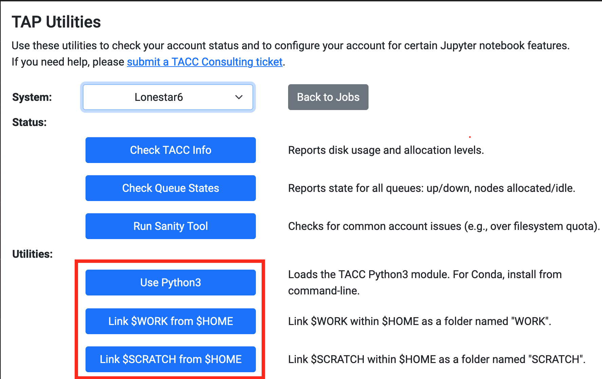

# LRS2Multi

## Setup for TACC users
To set up LRS2Multi on TACC you need the following commands to run "successfully."
```
ssh username@stampede2.tacc.utexas.edu
cd $HOME
ln -s $WORK work-stampede2
module load python3
pip3 install astropy --user
pip3 install seaborn --user
pip3 install specutils --user
pip3 install scikit-learn --user
cd /work/NUMBER/NAME/stampede2
git clone https://github.com/grzeimann/LRS2Multi.git
```
Then, go to the visualization portal in a browser: https://vis.tacc.utexas.edu/jobs/

You can sign in and proceed to the utilities page by clinking the tab at the bottom or visiting: https://vis.tacc.utexas.edu/jobs/utils/

<p align="center">
  
</p>

On the Utilities page, it the three bottom buttons to link Python3 and your directories for your work.

Then go back to the jobs page which should look like this:

<p align="center">
  
</p>

Request a job as shown in the attached image (just click submit when you pull up the same left hand settings). After a small wait time, a new screen will show up and you will click connect.  Sometimes there are not enough nodes initially and you have to wait a bit longer. After you connect, you should be in your work directory, which will allow you to navigate to LRS2Multi/notebooks.  There will be a file called example_reduction.ipynb.  Open that notebook and follow the instructions to get started.
