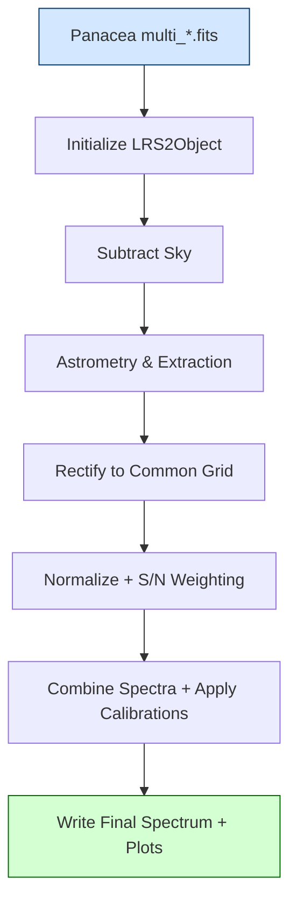

# LRS2Multi

**LRS2Multi** is a post-processing and extraction toolkit designed to operate on the reduced, flux-calibrated outputs from [**Panacea**](https://github.com/grzeimann/Panacea).  It provides higher-level combination, sky subtraction refinement, source extraction, and coaddition for the **LRS2 integral-field spectrograph** on the **Hobby–Eberly Telescope (HET)**.

---

## Table of Contents
- [Overview](#overview)
- [Key Features](#key-features)
- [Installation and Setup](#installation-and-setup)
- [Reduction Workflow](#reduction-workflow)
- [Algorithm Summary](#algorithm-summary)
- [Data Products](#data-products)
- [Developer Pointers](#developer-pointers)
- [Citation](#citation)

---

## Overview

LRS2Multi extends *Panacea*’s reductions by combining multiple exposures, modeling residual backgrounds, and extracting science-ready 1D spectra.  
Where *Panacea* works from CCD frames to flux-calibrated fibers, **LRS2Multi** works from *fibers to final spectra* — aligning, scaling, and coadding exposures across the four LRS2 channels (UV, Orange, Red, Far-Red).

---

## Key Features

- **Seamless integration with Panacea outputs**  
  Ingests calibrated 2D fiber spectra and metadata directly from Panacea.

- **Residual background and sky subtraction**  
  Refines Panacea’s sky model with local annular background fitting, per-fiber residual correction, PCA residual fitting, and/or polynomial modeling.

- **Aperture and PSF-weighted source extraction**  
  Performs circular or custom extraction apertures, with adaptive weighting for partially resolved sources.

- **Exposure alignment and coaddition**  
  Aligns wavelength grids, scales exposures using mean/median values of common wavelength overlap regions, and coadds using inverse-variance weighting.

- **Quality-assurance products**  
  Generates diagnostic plots and intermediate FITS extensions to validate flux scaling and sky subtraction.

---

## Installation and Setup

### For TACC users

```bash
ssh username@ls6.tacc.utexas.edu
cd $HOME
ln -s $WORK work-ls6
module load python3
pip3 install astropy seaborn specutils scikit-learn --user
cd /work/XXXX/USERNAME/ls6
git clone https://github.com/grzeimann/LRS2Multi.git
```

Then, go to the visualization portal in a browser: https://vis.tacc.utexas.edu/jobs/

You can sign in and proceed to the utilities page by clinking the tab at the bottom or visiting: https://vis.tacc.utexas.edu/jobs/utils/

<p align="center">
  
</p>

On the Utilities page, it the three bottom buttons to link Python3 and your directories for your work.

Then go back to the jobs page which should look like this:

<p align="center">
  
</p>

Request a job as shown in the attached image (just click submit when you pull up the same left hand settings). After a small wait time, a new screen will show up and you will click connect.  Sometimes there are not enough nodes initially and you have to wait a bit longer. After you connect, you should be in your work directory, which will allow you to navigate to LRS2Multi/notebooks.  There will be a file called example_reduction.ipynb.  Open that notebook and follow the instructions to get started.

# Example Usage: LRS2Multi Reduction Workflow

This example demonstrates a complete reduction workflow using **LRS2Multi** and **LRS2Object**.  
It converts **Panacea**-reduced exposures into a single, flux-calibrated 1D spectrum with telluric correction,  
sky subtraction, astrometry, extraction, and diagnostic plots.  

> **Requirements:**  
> - Panacea multi-extension FITS products on disk  
> - Python 3 environment with `astropy`, `numpy`, `matplotlib`, and `seaborn`  
> - `lrs2multi` and `lrs2object` available on your `PYTHONPATH`

---

## 1. Setup and Imports

```python
import sys, glob, os.path as op
sys.path.append("..")  # import local lrs2multi modules

import numpy as np
import seaborn as sns
import matplotlib.pyplot as plt
from astropy.io import fits
from astropy.table import Table
from datetime import datetime, timedelta

from lrs2multi import LRS2Multi
from lrs2object import LRS2Object

%matplotlib inline

sns.set_context('talk')
sns.set_style('ticks')
plt.rcParams['font.serif'] = ['P052']
plt.rcParams['font.family'] = 'serif'

def_wave = np.arange(3650., 10500., 0.7)  # common wavelength grid
```

---

## 2. File Collection

Two helper functions, `get_scifiles_from_folder()` and `get_scifiles_from_folder_from_pos()`,  
collect relevant Panacea output FITS files from your observing directories.  
They filter by object name, exposure time, observing date, and LRS2 channel pairing.

```python
folders = ['/work/03946/hetdex/maverick/LRS2/UT24-1-015']

exclude_folder = [
  'multi_20230822_0000009_exp01', 'multi_20201110_0000013_exp01',
  'multi_20230727_0000010_exp01', 'multi_20250418_0000009_exp01',
  'multi_20250423_0000008_exp01', 'multi_20250429_0000007_exp01',
  'multi_20250912_0000014_exp01', 'multi_20250822_0000014_exp01'
]

objectname = 'OQ208'

filenames, _ = get_scifiles_from_folder(
    folders,
    object_name=objectname,
    exposure_min=0,
    exclude_folder=exclude_folder,
    keep_sky=False
)
if len(filenames) == 0:
    raise SystemExit(f"No files found for {objectname}")
```

Each file set includes the paired channels:
- **LRS2-B:** `uv` and `orange`
- **LRS2-R:** `red` and `farred`

---

## 3. Load Calibration Data

Load telluric transmission curves and a response correction derived from standard stars.

```python
telcor = fits.open('lrs2_avg_telluric.fits')[0].data[2]

response_all = fits.open('response_correction.fits')[0].data[1]
wsel = ((def_wave>9000) & (def_wave<10050)) | (def_wave<3800) | (def_wave>10200)
response = np.interp(def_wave, def_wave[~wsel], response_all[~wsel])
```

These curves update the 2019 baseline response and model median telluric absorption.

---

## 4. Initialize the LRS2 Object

Create the `LRS2Object` instance to control data reduction.

```python
LRS2 = LRS2Object(
    filenames,
    detwave=6600.,              # detection wavelength in Å
    wave_window=100.,           # full detection window
    red_detect_channel='red',   # channel for detection on red side
    blue_detect_channel='orange',
    ignore_mask=False
)
```

> **Tip:** choose `detwave` between 6450–6950 Å when combining LRS2-B and LRS2-R.

---

## 5. Sky Subtraction

The sky subtraction step removes background emission from each exposure.  
This is the most tunable component of the reduction.

```python
LRS2.subtract_sky(
    func=np.nansum,
    local=False,
    pca=False,
    correct_ftf_from_skylines=False,
    sky_radius=4.0,
    obj_radius=1.5,
    inner_sky_radius=2.5,
    outer_sky_radius=5.0,
    sky_annulus=True,
    polymodel=False,
    polyorder=5,
    ncomp=25,
    bins=25,
    peakthresh=2.,
    pca_iter=3,
    elliptical=False,
    a_radius=3.0,
    b_radius=5.5,
    rotation_angle=-50.
)
```

**Tuning options:**
- `local=True` for crowded or extended sources.  
- Adjust `sky_radius`, `inner_sky_radius`, `outer_sky_radius`, and `obj_radius` to define background regions.  
- `pca=True` enables principal component sky modeling for complex residuals.

---

## 6. Astrometry and Extraction

Compute fiber-to-sky coordinates, extract spectra, and standardize resolution.

```python
LRS2.get_astrometry()
LRS2.extract_spectrum(radius=2.5, use_aperture=True)
LRS2.smooth_resolution(redkernel=0.1, bluekernel=0.1)
LRS2.rectify(def_wave)
```

You can optionally set manual extractions (`set_manual_extraction`) or supply PSF-based extractions  
with Gaussian models for better point-source control.  If `use_aperture=False`, then the source is
modeled through an automated pipeline and extracted using optimal weights built from the 2D Gaussian model.

---

## 7. Combine and Calibrate

Normalize, compute S/N, coadd, and apply calibration.

```python
LRS2.normalize(detwave=6600., wave_window=100., func=np.nanmedian)
LRS2.calculate_sn()
LRS2.combine_spectra()
LRS2.spec1D = LRS2.spec1D * response
LRS2.write_combined_spectrum(telcor=telcor)
```

Output FITS files include flux, error, wavelength, and telluric-corrected columns.

---

## 8. Visual Diagnostics (2D Images)

```python
LRS2.setup_plotting()
for key in LRS2.sides:
    for L in LRS2.sides[key]:
        if L.channel in ['orange','red']:
            L.plot_image(
                radius=2.5, func=np.nanmedian, attr='skysub',
                quick_skysub=False, sky_radius=4.0, wave_window=100.,
                inner_sky_radius=2.5, outer_sky_radius=5.0,
                sky_annulus=True, elliptical=False,
                a_radius=3.0, b_radius=5.5, rotation_angle=-50.
            )
LRS2.fig.savefig(f'{objectname}_image_plot.png', dpi=150)
```

This creates a collapsed image with apertures and sky annuli visualized for QA.

---

## 9. Optional 3D Cube Construction

You can create and merge spatially rectified cubes.

```python
LRS2.make_cube(def_wave, ran=[-7., 7., -7., 7.])
LRS2.combine_cubes()
LRS2.spec3D = LRS2.spec3D * response / telcor
LRS2.write_cube(outname=f"{objectname}_combined_cube.fits")
```

---

## 10. Plot Final 1D Spectrum

Produce multi-panel plots of the extracted and combined spectra.

```python
wran = [[3650, 10450], [3800, 4150], [6120, 6620], [7000, 7300], [9600, 10000]]
fig, ax = plt.subplots(5, 1, figsize=(20, 10))

for i, wr in enumerate(wran):
    wave = LRS2.spec1D.spectral_axis.value
    flux = LRS2.spec1D.flux.value
    sel = (wave > wr[0]) & (wave < wr[1])
    ax[i].step(wave[sel], flux[sel]/1e-17, lw=0.5, color='firebrick')

    for key in LRS2.sides:
        for L in LRS2.sides[key]:
            s = (L.spec1D.spectral_axis.value > wr[0]) & (L.spec1D.spectral_axis.value < wr[1])
            ax[i].plot(L.spec1D.spectral_axis.value[s],
                       L.spec1D.flux.value[s]/1e-17 * response[s],
                       lw=0.5, color='grey')

fig.savefig(f'{objectname}_spectrum_plot.png', dpi=150)
```

---

## 11. Key Parameters

| Parameter | Description | Typical Values |
|------------|-------------|----------------|
| `folders` | Directories containing Panacea outputs | `/work/.../LRS2/UTxx-x-xxx` |
| `objectname` | Target name matching `OBJECT` header | e.g. `"OQ208"` |
| `detwave` | Detection wavelength (Å) | 6450–6950 |
| `wave_window` | Full detection window width (Å) | 50–150 |
| `radius` | Extraction aperture radius (arcsec) | 1.5–3.0 |
| `sky_radius` | Minimum distance to define sky fibers | 3–5 |
| `local` | Use local sky subtraction | `True`/`False` |
| `response`, `telcor` | Response and telluric arrays | Derived above |

---

## 12. Outputs

| File | Description |
|------|--------------|
| `{OBJECT}_combined.fits` | Final 1D coadded spectrum with telluric correction |
| `{OBJECT}_image_plot.png` | Collapsed image of sky-subtracted fibers |
| `{OBJECT}_spectrum_plot.png` | Multi-panel spectrum diagnostic |
| `{OBJECT}_combined_cube.fits` | Optional combined 3D cube |

---

## 13. Processing Flow Diagram



---

### Summary

This example notebook provides a comprehensive, reproducible workflow for LRS2 data combination and calibration.  
Users typically adjust only:
- **Target selection parameters** (`folders`, `objectname`)  
- **Sky subtraction geometry** (`local`, `sky_radius`, `obj_radius`)  
- **Extraction aperture** (`radius`)  
- **Detection wavelength** (`detwave`)

The rest of the process—extraction, sky subtraction, coaddition, and calibration—is handled automatically by LRS2Multi and LRS2Object.

---
